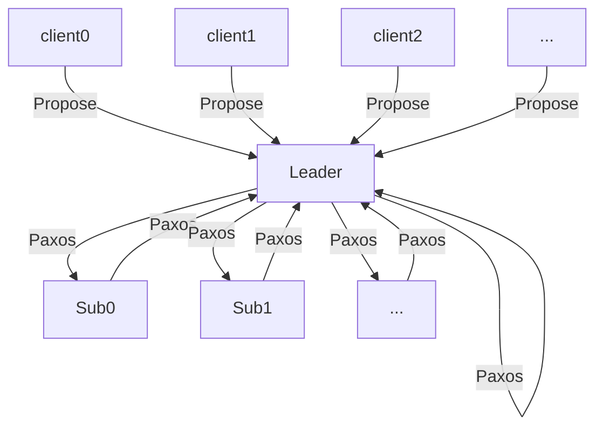

# Server网络构建流程简释

```flow
st=>start: PeerConnections
e=>end: End
op0=>operation: partition
cond=>condition: < this.Id?
ctp=>subroutine: ConnectToPeers
wfp=>subroutine: WaitingForPeers
op1=>operation: listen

st->op0->cond
cond(yes)->ctp->op1
cond(no)->wfp->op1
op1->e
```

```flow
st=>start: ConnectToPeers
e=>end: End
cond0=>condition: EmptySet
op1=>operation: send this.Id
op3=>operation: Alive = true
op2=>operation: establish I/O stream
st->cond0
cond0(yes, left)->e
cond0(no, right)->op1->op2->op3(left)->cond0
```

```flow
st=>start: WaitingForPeers
e=>end: End
cond0=>condition: EmptySet
cond1=>condition: connect
op0=>operation: Accept
op1=>operation: receive remote.Id
op2=>operation: Alive = true
op3=>operation: establish I/O stream
op4=>operation: pop
st->cond0
cond0(yes, right)->e
cond0(no)->op0->cond1
cond1(no, left)->op0->op1->op3(right)->op2(right)->cond0
```


# Server消息处理流程

```flow
st=>start: compact
op0=>operation: dump cMessages to restoredRequestList
op1=>operation: shuffle restoredRequestList
cond=>condition: restoredRequestList.isEmpty
cpm=>subroutine: compactChan.put(requests)
sleep=>subroutine: Thread.sleep

st->op0->cond
cond(yes)->sleep
cond(no,down)->op1->cpm(right)->sleep
sleep(right)->op0
```

```flow
st=>start: peerConversation
ed=>end: End
op0=>subroutine: msg = pMessage.poll(WAITING_TIME)
op1=>operation: categorization
cond=>condition: msg == null
op2=>subroutine: handle
sleep=>subroutine: Thread.sleep

st->op0->cond
cond(yes)->ed
cond(no,down)->op1->op2(right)->ed
```

```flow
st=>start: paxosRoutine
ed=>end: End
op0=>subroutine: msg = compactChan.poll(WAITING_TIME)
op1=>subroutine: peerConversation
cond=>condition: msg == null
op2=>subroutine: handleRequests(msg)
sleep=>subroutine: Thread.sleep

st->op1->op0(right)->cond
cond(yes)->op1
cond(no)->op2(right)->op1
```


# Server网络组织结构




# Server达成共识时序简释

```sequence
Title: [0] Start Init NORMAL
Note over server1: <null>
Note over server0: <leaderId, PREPARING, inst_ballot, []>
server0->>server1: pepare(inst_no, leaderId, inst_ballot)
Note over server1: <leaderId, PREPARING>
server1-->>server0: pReply(inst_no, PROCEED, leaderId, inst_ballot, [])
Note over server0: accumulating
Note over server0: <leaderId, PREPARED, inst_ballot, []>
server0->>server1: accept(inst_no, leaderId, inst_ballot, cmds)
Note over server1: <leaderId, ACCEPTED, inst_ballot, null>
server1-->>server0: aReply(inst_no, PROCEED, leaderId, inst_ballot, [], cmds)
Note over server0: accumulating
Note over server0: <leaderId, COMMITTED, inst_ballot, []>
server0->>server1: commit(inst_no, leaderId, inst_ballot, cmds)
Note over server1: <leaderId, COMMITTED, inst_ballot, null>
```

```sequence
Title: [1] Start Restore early NORMAL (lastLeaderId < leaderId)
Note over server1: <lastLeaderId, [PREPARED/PREPARING && mu != null][ACCEPTED], last_ballot, ?>
Note over server0: <leaderId, PREPARING, inst_ballot, []>
server0->>server1: pepare(inst_no, leaderId, inst_ballot)
Note over server1: <leaderId, PREPARING, inst_ballot, null>
server1-->>server0: pReply(inst_no, RESTORE, leaderId, inst_ballot, last_instr)
Note over server0: accumulating
Note over server0: restore local.proposals and switch to the latest last_instr
Note over server0: <leaderId, PREPARED, inst_ballot, [...]>
server0->>server1: accept(inst_no, leaderId, inst_ballot, last_cmds)
Note over server1: <leaderId, ACCEPTED, inst_ballot, null>
server1-->>server0: aReply(inst_no, PROCEED, leaderId, inst_ballot, [], last_cmds)
Note over server0: accumulating
Note over server0: <leaderId, COMMITTED, inst_ballot, [...]>
server0->>server1: commit(inst_no, leaderId, last_ballot, last_cmds)
Note over server1: <leaderId, COMMITTED, inst_ballot, null>
```

```sequence
Title: [2] Start Restore late NORMAL (lastLeaderId < leaderId)
Note over server1: <lastLeaderId, [PREPARED/PREPARING && mu != null][ACCEPTED], last_ballot, ?>
Note over server0: <leaderId, PREPARING, inst_ballot, []>
Note over server0: accumulating
Note over server0: <leaderId, PREPARED, inst_ballot, [...]>
server0->>server1: accept(inst_no, leaderId, inst_ballot, cmds)
Note over server1: <leaderId, ACCEPTED, inst_ballot, null>
server1-->>server0: aReply(inst_no, RESTORE, leaderId, inst_ballot, last_inst, cmds)
Note over server0: check and restore last_inst
Note over server0: accumulating
Note over server0: <leaderId, COMMITTED, inst_ballot, [...]>
server0->>server1: commit(inst_no, leaderId, last_ballot, cmds)
Note over server1: <leaderId, COMMITTED, inst_ballot, null>
```

```sequence
Title: [3] Restart Recovery NORMAL (lastLeaderId <= leaderId)
Note over server1: <lastLeaderId, COMMITTED, last_ballot, ?>
Note over server0: <leaderId, PREPARING, inst_ballot, []>
server0->>server1: pepare(inst_no, leaderId, inst_ballot)
Note over server1: <leaderId, COMMITTED, inst_ballot, null>
Note over server0: <leaderId, PREPARING, inst_ballot, [...]>
Note over server0: accumulating
server1-->>server0: pReply(inst_no, RECOVER, leaderId, inst_ballot, last_inst)
Note over server0: restore local.proposals and switch to the last_inst immediately
Note over server0: <leaderId, COMMITTED, inst_ballot, [...]>
server0->>server1: commit(inst_no, leaderId, inst_ballot, cmds)
Note over server1: <leaderId, COMMITTED, inst_ballot, null>
```

```sequence
Title: [4] Start Competitors early ABORT (lastLeaderId > leaderId)
Note over server1: <lastLeaderId, _, last_ballot, ?>
Note over server0: <leaderId, PREPARING, inst_ballot, []>
server0->>server1: pepare(inst_no, leaderId, inst_ballot)
Note over server1: <lastLeaderId, _, last_ballot, ?>
server1-->>server0: pReply(inst_no, abort, lastLeaderId, inst_ballot, last_inst)
server0-->>lastLeaderId_server: restore(local.proposals)
Note over server0: <lastLeaderId, _, last_ballot, null>
```

```sequence
Title: [5] Start Competitors late ABORT (lastLeaderId > leaderId)
Note over server1: <lastLeaderId, _, last_ballot, ?>
Note over server0: <leaderId, PREPARING, inst_ballot, []>
server0->>server1: accept(inst_no, leaderId, inst_ballot, cmd)
Note over server1: <lastLeaderId, _, last_ballot, ?>
server1-->>server0: aReply(inst_no, abort, lstLeaderId, inst_ballot, last_inst)
server0-->>lastLeaderId_server: restore(local.proposals)
Note over server0: <lastLeaderId, _, last_ballot, null>
```

## disk-paxos

```sequence
Title: [0] Start Init NORMAL
Note over server0: <leaderId, PREPARING, inst_ballot, dialog_no, []>
server0->>server1: [dialog_no, write(inst_no, leaderId, inst), [read(inst_no, leaderId, accessId_0), ...]]
server1-->>server0: [dialog_no, ackWrite(inst_no, WRITE_SUCCESS, leaderId, []), []]
Note over server0: accumulating
Note over server0: <leaderId, PREPARED, inst_ballot, dialog_no', []>
server0->>server1: [dialog_no', write(inst_no, leaderId, inst), [read(inst_no, leaderId, accessId_0), ...]]
server1-->>server0: [dialog_no', ackWrite(inst_no, WRITE_SUCCESS, leaderId, []), []]
Note over server0: accumulating
Note over server0: <leaderId, COMMITTED, inst_ballot, []>
server0->>server1: commit(inst_no, leaderId, inst_ballot, cmds)
```